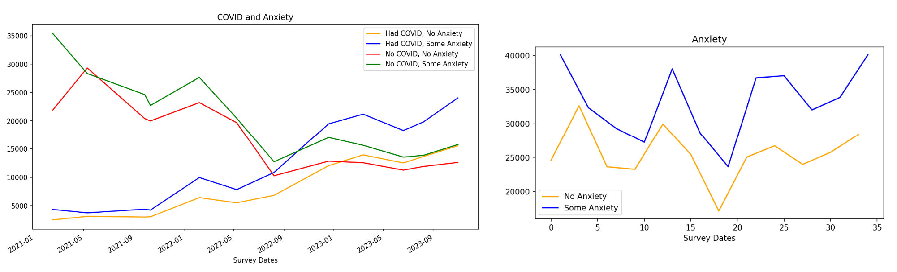
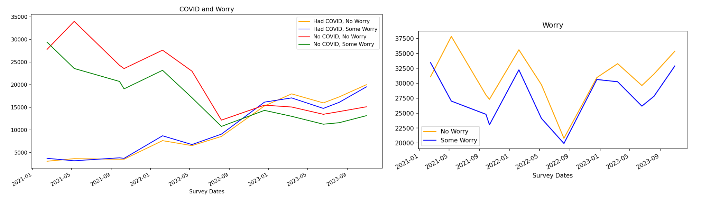
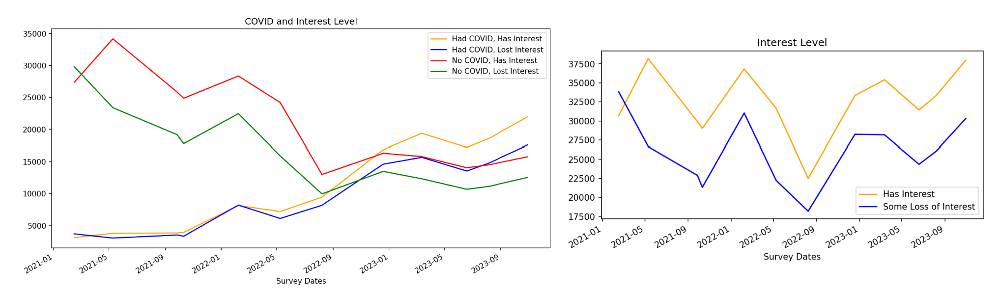
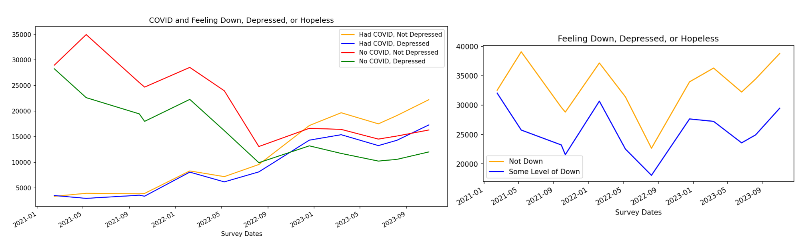

# Coronavirus (COVID-19) Effects on Mental Health
This is a group project the MSU AI Bootcamp.  For this project, we worked as a group to find and analyze a dataset of our choice.
We selected the U.S. Census Bureau Household Pulse Survey (HPS) from 2021-2023 to analyze COVID-19 and it's effects on Anxiety, Worry,
Interest Level, and Depression (Down).

Team DIVOC-91:  Tom Clemons, Chris Martella,  Taylor Peterson,  Isaac Pingel 

## Description

**Coronavirus (COVID-19) Effects on Mental Health**
- Our goals were to identify the effects of COVID-19, and the pandemic generally, on mental health of the U.S. Population based upon the standardized survey and reporting of the U.S. Census Bureau HPS 2021-2023.
- The intent of our analysis is to provide insight for healthcare professionals, medical institutions, and pharmaceutical companies on COVID-19 and it's effects on Anxiety, Worry, Interest Level, and Depression.   
- Our graph and dataframe outputs provide evidence of any correlations between historical contraction of COVID-19 and frequency / intensity of Anxiety, Worry, Interest Level, and Depression.

## Getting Started

### Dependencies

- Python 3.10
- Python NumPy
- Python Matplotlib
- Jupyter Notebooks

### Installing

- Clone this repo to your environment 

### Notebooks and Data Files 

**Notebooks created for this project:** 
| **Notebook** | **Description** |
| --- | --- | 
| **Analysis & Plotting:** | | 
| **covid_analysis_plots.ipynb** | Reads 2021-2023 pulse survey data all columns file and plots **COVID and Anxious, Worry, Interest Level, and Down** responses |
| **feelings_analysis_plots.ipynb** | Reads 2021-2023 pulse survey data all columns file and plots **Anxious, Worry, Interest Level, and Down** responses |
| | |
| **Create Survey Analysis Data Files:** | | 
| **create_2021_analysis_data_file.ipynb** | Reads 2021 HPS files to create the **pulse2021_survey_data.csv** |
| | and **pulse2021_survey_data_all_cols.csv** data files | 
| **create_2022_analysis_data_file.ipynb** | Reads 2022 HPS files to create the **pulse2022_survey_data.csv** |
| | and **pulse2022_survey_data_all_cols.csv** data files |  
| **create_2023_analysis_data_file.ipynb** | Reads 2023 HPS files to create the **pulse2023_survey_data.csv** |  
| | and **pulse2023_survey_data_all_cols.csv** data files | 

**HPS Public Use Files (PUF) contained in the Resources folder:** 
| **Survey File** | **Description** | **Survey Period** | 
| --- | :-: | :-: |
| **2021 data:** | | |
| **pulse2021_puf_24.csv** | 2021 1Q U.S. Census Bureau HPS | 2/3/2021 - 2/15/2021 | 
| **pulse2021_puf_29.csv** | 2021 2Q U.S. Census Bureau HPS | 4/28/2021 - 5/10/2021 | 
| **pulse2021_puf_38.csv** | 2021 3Q U.S. Census Bureau HPS | 9/15/2021 - 9/27/2021 | 
| **pulse2021_puf_39.csv** | 2021 4Q U.S. Census Bureau HPS | 9/29/2021 - 10/11/2021 | 
| | | |
| **2022 data:** | | | 
| **pulse2022_puf_42.csv** | 2022 1Q U.S. Census Bureau HPS | 1/26/2022 - 2/7/2022 | 
| **pulse2022_puf_45.csv** | 2022 2Q U.S. Census Bureau HPS | 4/27/2022 - 5/9/2022 | 
| **pulse2022_puf_48.csv** | 2022 3Q U.S. Census Bureau HPS | 7/27/2022 - 8/8/2022 | 
| **pulse2022_puf_52.csv** | 2022 4Q U.S. Census Bureau HPS | 12/9/2022 - 12/19/2022 | 
| | | |
| **2023 data:** | | | 
| **pulse2023_puf_55_2023_1Q.csv** | 2023 1Q U.S. Census Bureau HPS | 3/1/2023 - 3/13/2023 | 
| **pulse2023_puf_58_2023_2Q.csv** | 2023 2Q U.S. Census Bureau HPS | 6/72023 - 6/19/2023 | 
| **pulse2023_puf_60_2023_3Q.csv** | 2023 3Q U.S. Census Bureau HPS | 7/26/2023 - 8/7/2023 | 
| **pulse2023_puf_63_2023_4Q.csv** | 2023 4Q U.S. Census Bureau HPS | 10/18/2023 - 10/30/2023 | 

**Full Year Survey data files created by notebooks:** 
Note:  These files will be overlayed if you run the create analysis data file notebooks

| **Survey File** | **Description** | **Created By** | 
| --- | :-: | :-: |
| **2021 data:** | | |
| **pulse2021_survey_data.csv** | 2021 Full Year HPS file (reduced set of analysis data fields) | **create_2021_analysis_data_file.ipynb** | 
| **pulse2021_survey_all_cols_data.csv** | 2021 Full Year HPS file (all analysis data fields) | **create_2021_analysis_data_file.ipynb** | 
| **pulse2022_survey_data.csv** | 2022 Full Year HPS file (reduced set of analysis data fields) | **create_2022_analysis_data_file.ipynb** | 
| **pulse2022_survey_all_cols_data.csv** | 2022 Full Year HPS file (all analysis data fields) | **create_2022_analysis_data_file.ipynb** | 
| **pulse2023_survey_data.csv** | 2023 Full Year HPS file (reduced set of analysis data fields) | **create_2023_analysis_data_file.ipynb** | 
| **pulse2023_survey_all_cols_data.csv** | 2023 Full Year HPS file (all analysis data fields) | **create_2023_analysis_data_file.ipynb** | 

### Executing programs

- **COVID vs. Anxious, Worry, Interest Level, and Down** plots:
    1. Open '**covid_analysis_plots.ipynb**' from your cloned repo in Jupyter Notebook to see the plots of **COVID vs. Anxious, Worry, Interest Level, and Down** responses. 
    2. Step through the completed notebook to see my data preparation by clicking the "Run" button.
    3. The results are displayed after each step.

- **Anxious, Worry, Interest Level, and Down** plots:
    1. Open '**feelings_analysis_plots.ipynb**' from your cloned repo in Jupyter Notebook to see the plots of **Anxious, Worry, Interest Level, and Down** responses. 
    2. Step through the completed notebook to see my data preparation by clicking the "Run" button.
    3. The results are displayed after each step.

- Note: All survey data files are provided in the Resources folder.  You don't need to run the notebooks to create the pulse survey data files unless you make some changes to the create data file notebooks

## Group Project Analysis

### 1. Goals/Questions to be addressed
- Question #1: Is there any correlation between the number of positive COVID-19 infections and anxiety / fear over the three (3) year sample period?
- Question #2: What, if any, correlation exists among having COVID-19 and the feeling of worry or mailaize?  
- Question #3: Does having COVID-19 increase or decrease a respondent's level of interest in everyday activities?
- Question #4: Does having COVID-19 increase or decrease a respondent's feeling of depression or hopelessness? 

### 2. Overview of data collection, cleanup and exploration process
- Data sourced from the U.S. Census Bureau’s HPS bi-weekly survey 2020-2023.
- Surveys are a collaborative effort of numerous governmental agencies (CDC, FDA, HHS, NCHS).
- The HPS columns changed significantly (from 81 to over 250 questions), survey questions were removed and others added, over the many survey phases through the pandemic lifecycle.
- These changes in survey questions resulted in significant cleaning and organizing of the datasets and dataframes to create uniform and consistent responses to work with.
- Our cleaning and standardization of the HPS survey data focused on creating a uniform datasets and response categories over calendar quarters from 2020-2023 (most notably the removal of early 2020 responses as the Survey data and questions were in their infancy).

### 3. Approach taken to achieve goals
1. **Dataset Selection and Modification**
    - Randomized the selection of bi-weekly survey responses over annual quarters.
    - Imported each selected .CSV survey response file into our project repository.
    - Standardized and concatenated quarterly .CSV survey files by year into annual databases.
2. **Cleaning and Refining**
    - Analyze survey columns to check for completeness and quality of responses
    - Identify and clean columns to ensure consistency
    - Merge similar responses by column and ensure data types are consistent (int, datetime, etc.)
3. **Graphing and Analysis**
    - Graphed full year dataframes to make comparisons
    - Refined and regraphed based on results
4. **Draw Conclusions**
    - Made observations based on analysis

## Group Project Analysis Results/Conclusions

### 1. Anxiety and COVID-19

- Of the survey sample, regardless of COVID-19 status, those reporting having some level of anxiety are greater than those that reported no anxiety.
- It appears that having COVID-19 does not materially change the percentage of those expressing some feeling of anxiety as compared to those that report not being anxious.    
- A larger percentage of those with COVID-19 experience anxiety than those that have not contracted COVID-19.  

### 2. Worry and COVID-19

- It appears that regardless of COVID-19 status, respondents not experiencing worry exceeded those experiencing worry.
- Based on the visual plotting, the dataset and levels of worry, whether or not the respondent has COVID-19, are approaching the median.  
- Unlike anxiety, of those with COVID-19, the respondents reporting no worry sometimes exceed those experiencing some worry after the infected population increases over the non-infected population numbers.   

### 3. Interest Level and COVID-19

- It appears that regardless of COVID-19 status, respondents not experiencing loss of interest exceeded those experiencing interest in doing daily activities.
- Although interest is highly similar to feelings of worry in those who reported to not have COVID-19, we can see that interest levels are slowly increasing the gap between those who are not interested in daily activities, amongst COVID-19 positive respondents. Feelings of interest stay above those who experienced loss of interest, with feelings of interest increasing more during the third quarter of 2023.
- Just like our graphs of anxiety and worry, we see that towards the end of 2022 and going into 2023, the responses are approaching the median as the pandemic is slowing down.

### 4. Depression (Down) and COVID-19

- Visually, it appears that COVID-19 did not increase feelings of depression to the point where they surpassed those reporting not having intense feelings of depression.
- Compared to levels of anxiety experienced through COVID-19, those who experienced feelings of depression stayed below those that did not experience any feelings of depression. This was true regardless of COVID-19 status, showing no drastic correlation between the two.
- It appears that of the respondents that reported a positive COVID-19 status, depression follows closely with loss of interest. In fact, their trajectories, either with or without COVID-19, are nearly identical.

### Group Project Analysis Summary
- There does not appear to be a correlation between COVID-19 infections and depression, anxiety, lack of interest in everyday tasks, and worsening mental health.  The relationship remained constant over the survey period.
- Regardless of COVID-19 Status, the resultant effect on mental health approaches a similar median value and trajectory.
- Feelings of anxiety is the only factor seen to have stayed above no feelings of anxiety throughout the three year period. People are generally anxious, with those having a positive COVID-19 status gradually increasing more, especially towards the end of 2023.

### Problems Encountered 
- Generally COVID-19 has been a limited time period and the HPS questions changed numerous times over the survey period.  At least annually, the survey questions expanded or contracted without true qualification and the weighted averaging modified the raw data making analysis / categorization difficult. In addition, the responses allowed within questions varied over such survey phases. 
- The amount of survey participants that did not respond to individual questions or the same question over multiple surveys resulted in inconsistent and sometimes inadequate sample sizes.  Additionally, the subjectivity of certain questions allowed for significant variance in responses based on the ontology and perception of the respondent.
- The HPS contained additional categories and questions (and by correlation responses) that may be dispositive of anxiety levels, worry, interest, and depression (e.g.: job loss, employment status, food scarcity, geographical location, income, and housing status).  Inclusion or plotting of such categories may provide additional insight into our analysis or findings. 

### Future Considerations 
1. What other societal events affect the level of anxiety with respondents?
2. The HPS contained additional categories and questions that may be dispositive of anxiety levels, worry, interest, and depression (e.g.: job loss, employment status, food scarcity, geographical location, income, and housing status).  
3. A portion of the HPS included a variety of questions about children’s educational access in the home after the effects of COVID-19 (the shift to distanced learning, computer availability in the home for educational purposes, accessible internet services, and homeschooling). We focused strictly on adults for our analysis, but wIth the added stress of children and their education style drastically changing, could this result in a correlation to their mental well-being?
4. Stimulus payments were distributed throughout the pandemic. Would the portion of the population that received these see a boost to their mental states and a decrease in stress levels?

## Help

- These consolidated full year files will be overlayed if you run the create analysis data file notebooks
- All survey data files are provided in the Resources folder.  You don't need to run the notebooks to create the pulse survey data files unless you make some changes to the create data file notebooks

## Authors

- Authors:  Chris Martella,  Taylor Peterson,  Isaac Pingel, Thomas Clemons

## Version History

- 0.1
    - Initial Release

## Acknowledgments

- U.S. Census Bureau HPS Overview - [https://www.census.gov/programs-surveys/household-pulse-survey.html](https://www.census.gov/programs-surveys/household-pulse-survey.html)
- U.S. Census Bureau HPS Public Use Files (PUF) -[https://www.census.gov/programs-surveys/household-pulse-survey/datasets.html](https://www.census.gov/programs-surveys/household-pulse-survey/datasets.html)
- U.S. Census Bureau Article: Frontline Workers More Likely to Report Symptoms of Anxiety, Depressive Disorder -  https://www.census.gov/library/stories/2022/02/frontline-workers-more-likely-to-report-symptoms-of-anxiety-depressive-disorder.html
- Analyze Survey Data with Python for Beginners | Pandas Youtube video - [https://www.youtube.com/watch?v=B-lliwc0ZMk](https://www.youtube.com/watch?v=B-lliwc0ZMk)
